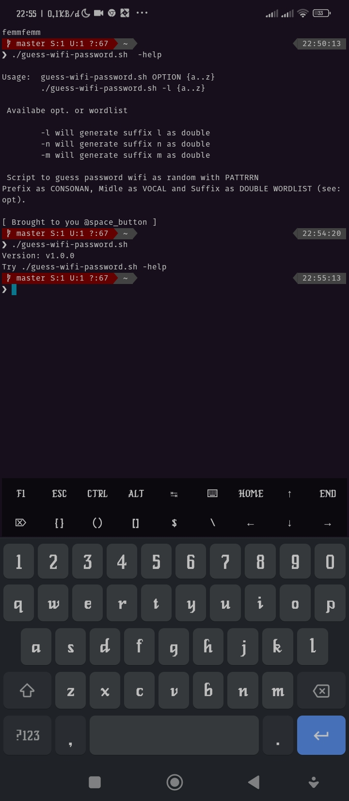

# guess-wifi-password.sh

Let's break into your neighbor's wifi security with the wordlist similar to the word "semmsemm" at random.

# Screenshot 


[](https://asciinema.org/a/561147)

the screenshot above has something to do with the demo.mp4 file, please watch the video.

# Usage :

```./guess-wifi-password -m {a..z}``` 

or

```bash repeat.sh 15 "bash guess-wifi-password.sh -mm"```

one liner with progressbar 

```
bash repeat.sh 100 "bash guess-wifi-password.sh -vv" | grep "e" | sort -u | pv -l -s 16 -p -e -t -i 0.1 -c -N "Tunggu"
```
will output "semmsemm" or whatever but the suffix will be preserved as m, for details see -help.

Motivation :
* Neighbor's wifi

* https://www.google.com/amp/s/www.detik.com/edu/detikpedia/d-5758742/mengenal-huruf-konsonan-dan-bedanya-dengan-vokal-serta-diftong/amp

Changelog:

0/0/0

+ Add script repeat.sh
+ Fix bug

07/03/23
+ Change repo name
